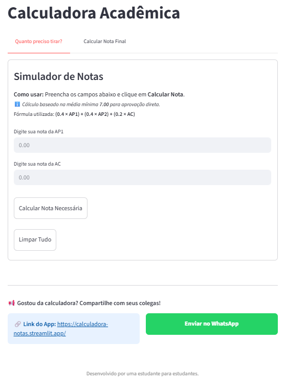

# 🎓 Calculadora Acadêmica

Um Web App desenvolvido em Python com o framework Streamlit, projetado para auxiliar estudantes do Ibmec na gestão de suas metas e notas acadêmicas. A interface foi otimizada para dispositivos móveis, garantindo agilidade no uso cotidiano.

| Interface do App | Acesse pelo Celular |
| :---: | :---: |
|  |  |

### ✨ Funcionalidades

O projeto oferece duas ferramentas principais organizadas em abas e link para compartilhamento em grupos:
1. **Simulador de Nota:** Calcula automaticamente a nota necessária na AP2 para atingir a média mínima de 7.0 e garantir a aprovação direta, sem necessidade de Prova Substitutiva (AS).
  -  Alerta caso o aluno precise obrigatoriamente da Prova Substitutiva (AS), mesmo tirando 10 na AP2.
2. **Cálculo de Média Final e Projeção de AS:** Processa as notas de AP1, AP2 e AC para fornecer a média final exata e o status de aprovação do aluno.
  - **Diferencial:** Caso o aluno não atinja a média 7.0, o sistema identifica automaticamente a menor nota entre AP1 e AP2 e calcula quanto ele precisa tirar na AS para ser aprovado.

3. **Compartilhamento Facilitado:** Botão de integração direta com WhatsApp para o compartilhamento da ferramenta entre grupos de estudo.

---

### 🛠️ Tecnologias e Lógica
- **Python:** Linguagem base para o processamento dos dados.

- **Streamlit:** Utilizado para a criação da interface web e deploy.

- **CSS Customizado:** Aplicado para garantir que as abas sejam nítidas no celular e o rodapé permaneça estável.

- **Lógica de Cálculo:** Implementação da fórmula ponderada institucional: $$Média = (0.4 \times AP1) + (0.4 \times AP2) + (0.2 \times AC)$$

---

### 🚀 Como acessar
A aplicação está disponível online através do Streamlit Cloud: 

👉 https://calculadora-notas.streamlit.app/ 

#### Como rodar localmente:
1. Clone o repositório: `git clone https://github.com/larissanobregaa/calculadora-notas.git`
2. Instale as dependências: `pip install -r requirements.txt`
3. Execute a aplicação: `streamlit run app.py`